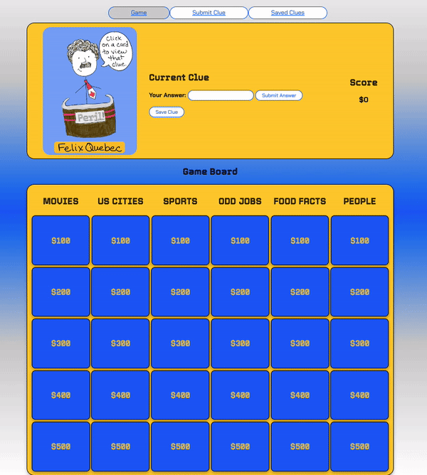
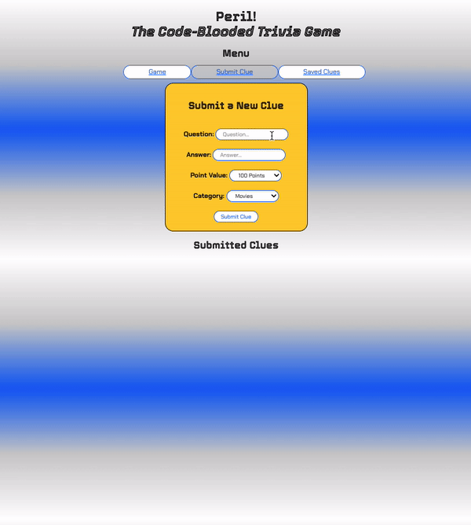
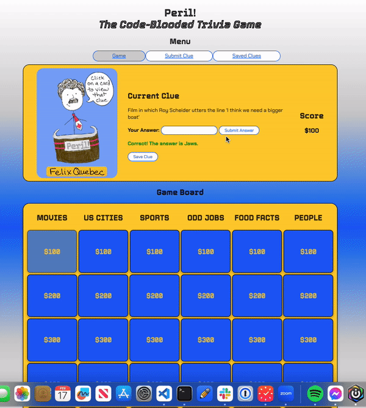

# Peril! A Code-Blooded Trivia Game
## Description
'Peril!' is a single-page application built using React. The app is a single-player trivia game meant to provide users with a fun and educational experience.

Users will be able to view a homepage that includes a game board filled with clue cards and a display where they can view the clue, submit their answer, and track their score. Users will also be able to save clues they want to refer back to, and they can submit a new clue that will post to the json server. 

## Installation
After forking and cloning the project, prior to launching the application, there are a few steps to follow to get the project up and running in your browser:
1. Run `npm install` in the terminal to install packages and resolve dependencies.
2. Run `npm start`. This will launch the development server in your browser. The default port it will run from is http://localhost:3000/.
3. Install JSON Server. Instructions for how to install JSON Server on your machine can be found in the [JSON Server Documentation](https://www.npmjs.com/package/json-server).
4. Once JSON Server is installed, run the following code from the terminal while in the project directory:
```
$ json-server --watch db.json --port 4000
```

## Usage
When clicking on a clue card, the clue will appear in the clue display above the game board, and the card itself will discolor to show that it has been deactivated. This will make it clear that this clue was already chosen and cannot be utilized again.


When a user types in an answer and clicks "Submit Answer", the points score should update based on whether they answered correctly. If they answered correctly, they should see the the following text in green: "Correct! The answer is (clue answer)." 

If they answered incorrectly, the text should be in red.



If the user's answer is close but misspelled, they will still get points.


When navigating into the "Submit Clue" tab, users will see a section for submitting a new question, answer, point value, and category. After submitting, their clue will appear in the "Submitted Clues" list. Users will also be able to delete their submitted clues.



In the clue display, there is a button that allows users to save clues they would like to refer back to. When saving a clue, it is saved to the "Saved Clues" tab. If they click "unsave", it will be deleted. Users will also be able to delete these clues from their "Saved Clues" list in that tab.



## Roadmap
Future editions include:
- Interaction with an external API. For this project, we created a rest API with questions from https://jservice.io/. For the future, we would like to connect to this and populate the game board with randomly selected clues within the given categories.
- Ability to filter through and choose specific categories based on user preference.
- Ability to have the user's current status in the game persist after switching to a different route.
- Incorporating the submitted clues into the game. They will have the ability to be populated into the game board along with all other clues.

## Authors and Acknowledgement
- Bianca Aspin https://github.com/baspin94
- Brett de Bear https://github.com/BrettdeBear